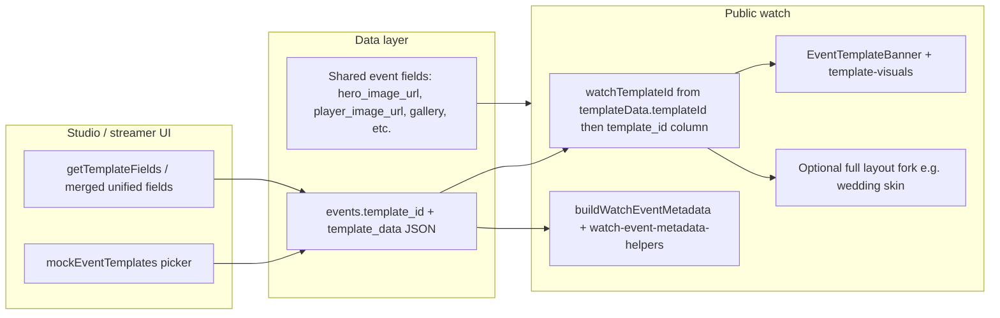

# Template implementation artifact: Wedding (`tpl-wedding`) and playbook for remaining templates

## Architecture (how templates flow through the app)

**Important distinction:** `template_data` stores template-specific keys (e.g. `brideName`) and should include `templateId: "tpl-*"` so the watch page resolves the correct skin even if `template_id` is stale ([`components/watch/watch-event-content.tsx`](../components/watch/watch-event-content.tsx) — resolution from JSON then column). Hero/player/gallery are **not** in `template_data`; they live on the event row and apply to all templates ([`lib/template-fields.ts`](../lib/template-fields.ts) header comment).

**Watch skins:** Tier-C layouts are registered in [`lib/watch-template-skin.ts`](../lib/watch-template-skin.ts) (`getWatchPageSkin` / `WATCH_TEMPLATE_SKIN_BY_ID`).

- **`tpl-wedding`** → `wedding` (classic cream + rose petals layout).
- **`tpl-wedding-garden`** → `weddingGarden` (**Ethereal Garden**: sage/cream watercolor feel, floating florals, glass stream shell, emerald chat chrome, schedule + stream + optional hero blurb; full fields live in **`renderDetailsPanel("garden")`**). Uses the **same** wedding `template_data` keys (`brideName`, `groomName`, `couplePhoto`, `venueName`, `customMessage`, `familyNames`, …).
- **`tpl-wedding-midnight`** → `weddingMidnight` (**Midnight Elegance**: black + gold grid, particles, Italiana/Rajdhani, gold-shimmer names, dark stream shell, mono “live channel” chat, `renderDetailsPanel("midnight")`). Same wedding `template_data` keys as above.
- **`tpl-wedding-coastal`** → `weddingCoastal` (**Coastal Breeze**: wave `#edf6f9` + sand texture, Pacifico/Quicksand, animated waves + rising bubbles, sea-glass stream shell, coral CTA, “Message in a Bottle” chat, `renderDetailsPanel("coastal")`). Same wedding `template_data` keys as above.
- **`tpl-wedding-celestial`** → `weddingCelestial` (**Celestial Dreams**: deep space `#0b0d17`, Cinzel + Space Grotesk, aurora + nebula + twinkling stars, moon + constellation SVG, gold gradient names, optional `customMessage` quote in glass card, cosmic glass stream shell + scanlines, “Cosmic Messages” chat (`Transmit…`), `renderDetailsPanel("celestial")`). Same wedding `template_data` keys as above.
- **`tpl-corporate-tech-forward`** → `corporateTechForward` (**Tech Forward Summit**: dark `#0a0a0a`, Inter + Space Grotesk (`font-corporate-tech-display`), animated grid + orbs + monospace data streams + scan line, glitch hero + gradient accent, glass preview card; live section uses neon-blue stream shell, scanline overlay, “Live discussion” chat chrome (`renderDetailsPanel("corporateTech")`). Uses **corporate** `template_data` keys plus optional `brandMark`, `heroLeadLine`, `heroAccentLine`.

---

## What has been done specifically for Wedding (`tpl-wedding`)

### 1. Template registry and picker

- **[`lib/mock-data.ts`](../lib/mock-data.ts)** — `mockEventTemplates` entry: stable id `tpl-wedding`, display name, **category `Wedding`**, thumbnail (falls back to default hero URL from [`lib/template-default-media.ts`](../lib/template-default-media.ts)).
- **[`lib/template-visuals.ts`](../lib/template-visuals.ts)** — `TEMPLATE_CATEGORY_CARD_GRADIENTS.Wedding` for the template card in the event form picker.

### 2. Form fields (schema)

- **[`lib/template-fields.ts`](../lib/template-fields.ts)** — Under key `wedding`: groups **Couple Details** (`brideName`, `groomName`, `couplePhoto`) and **Venue & Message** (`venueName`, `familyNames`, `customMessage`).
- **Note:** Non-`tpl-default` templates use a **merged** unified field set in the UI (`getMergedNonDefaultTemplateFieldGroups`); the `wedding` block still defines validation semantics and documents intended keys.

### 3. Default marketing / stock media

- **[`lib/template-default-media.ts`](../lib/template-default-media.ts)** — `TEMPLATE_DEFAULT_HERO_BACKDROP["tpl-wedding"]` → Unsplash URL when no hero/couple photo is set; **`tpl-wedding-garden`** → bundled [`public/templates/ethereal-garden-hero.png`](../public/templates/ethereal-garden-hero.png); **`tpl-wedding-midnight`** → dark luxury stock URL; **`tpl-wedding-coastal`** → beach / ocean stock URL; **`tpl-wedding-celestial`** → night sky / stars stock URL; **`tpl-corporate-tech-forward`** / **`tpl-corporate`** → bundled [`public/templates/corporate-tech-forward-hero.svg`](../public/templates/corporate-tech-forward-hero.svg) (dark grid + blue/cyan orbs, matches Tech Forward skin). `resolveWatchOgImageUrl` turns relative `/templates/...` paths into absolute URLs using the request base.

### 4. Watch banner (above stream on generic layout path)

- **[`lib/template-visuals.ts`](../lib/template-visuals.ts)** — `TEMPLATE_BANNER_ACCENT_BORDER["tpl-wedding"]`; **`extractTemplateBannerContent`** branch builds headline from `brideName`/`groomName`, lines from venue/family/message/description.
- **[`components/watch/event-template-banner.tsx`](../components/watch/event-template-banner.tsx)** — **Dedicated light “Wedding” banner** when `templateId === "tpl-wedding"` (rose/amber gradient, couple headline, chips from detail lines). Other templates use the **category dark banner** from `TEMPLATE_CATEGORY_BANNER_THEME`.

### 5. Full watch-page experience (unique to Wedding today)

All in **[`components/watch/watch-event-content.tsx`](../components/watch/watch-event-content.tsx)** when `getWatchPageSkin(watchTemplateId) === "wedding"`:

| Area | Behavior |
|------|----------|
| **Layout** | Separate return branch: cream page bg (`#fefae0`), `font-wedding` ([`app/globals.css`](../app/globals.css) `--font-wedding` → Lato). |
| **Hero** | Full-viewport hero: backdrop = `heroImageUrl` → `couplePhoto` → default template URL → gradient; overlay; couple title with styled `&`; optional subtitle + description; date line / countdown when scheduled; CTA scrolls to `#wedding-stream`. |
| **Motion** | 15 floating “petals” with injected `@keyframes watchWeddingHtmlPetalFall`. |
| **Scheduled page** | Generic **scheduled-only** full-page countdown is **skipped** for wedding (`watchSkin !== "wedding"` guard) so the wedding hero owns countdown UX. |
| **Stream section** | `WEDDING_STREAM_SHELL` (rounded, rose/zinc gradient border); section heading “Watch Live Stream”; schedule list in amber typography. |
| **Player chrome** | LIVE badge uses **rose** instead of default red; viewer badge styling adjusted. |
| **Chat** | Renamed tone (“Live Wishes”), rose/stone palette, rounded inputs, amber send button. |
| **Details / gallery** | `weddingVisual` flag drives borders (`amber-200`, `#fefae0` panels) in `renderDetailsPanel` and `WatchPhotoGallery`. |

### 6. Title typography (form + watch)

- **[`lib/event-title-typography.ts`](../lib/event-title-typography.ts)** — `getTemplateDefaultTitleRem("tpl-wedding")` (and engagement/anniversary) set larger default hero rem; Google Font from `template_data` applied on watch via dynamic `<link>` in `watch-event-content`.

### 7. SEO / sharing

- **[`lib/watch-event-metadata-helpers.ts`](../lib/watch-event-metadata-helpers.ts)** — `buildWatchDisplayName()` uses **`brideName` & `groomName`** for document/OG title when present (aligned with on-page hero).
- **[`lib/watch-page-metadata.ts`](../lib/watch-page-metadata.ts)** — Fetches `/api/watch/...` with request-derived base URL; OG image resolution uses same hero priority as watch (`resolveWatchOgImageUrl`).

### 8. Template preview (marketing demo)

- **[`components/templates/wedding-template.tsx`](../components/templates/wedding-template.tsx)** — Standalone demo layout (timeline, mock chat, etc.).
- **[`app/templates/preview/[templateId]/page.tsx`](../app/templates/preview/[templateId]/page.tsx)** — Registers `tpl-wedding` in `templateContent` and `switch` to render `WeddingTemplate`.

### 9. Platform / API (shared, not wedding-only)

- **`/api/watch/*`** is public in middleware so **server `generateMetadata`** can load event JSON without browser cookies (fixes tab title / OG for slug and watch routes).

---

## What “remaining” templates already have vs Wedding

Most ids in [`lib/mock-data.ts`](../lib/mock-data.ts) already include:

- Picker card + category
- `TEMPLATE_BANNER_ACCENT_BORDER` + `extractTemplateBannerContent` branch in [`lib/template-visuals.ts`](../lib/template-visuals.ts)
- A matching field group (or overlap via merged form) in [`lib/template-fields.ts`](../lib/template-fields.ts)
- Preview: component + case in [`app/templates/preview/[templateId]/page.tsx`](../app/templates/preview/[templateId]/page.tsx)

They **do not** generally have:

- A **full alternate watch layout** — `tpl-wedding` → **`wedding`**, `tpl-wedding-garden` → **`weddingGarden`**, `tpl-wedding-midnight` → **`weddingMidnight`**, `tpl-wedding-coastal` → **`weddingCoastal`**, `tpl-wedding-celestial` → **`weddingCelestial`** in [`lib/watch-template-skin.ts`](../lib/watch-template-skin.ts)
- **`EventTemplateBanner` special case** — only Wedding has the light custom banner block
- **`buildWatchDisplayName`** logic — only wedding couple names are special-cased for meta title today

---

## Playbook: building or completing a new template

Use **tiers** so work stays proportional.

### Tier A — “Listed + editable + watchable” (minimum)

1. **Id** — Add `tpl-<name>` to [`mockEventTemplates`](../lib/mock-data.ts) with correct **category** string (must exist in `TEMPLATE_CATEGORY_*` maps or add it).
2. **Picker gradient** — If new category: add [`TEMPLATE_CATEGORY_CARD_GRADIENTS`](../lib/template-visuals.ts) and [`TEMPLATE_CATEGORY_BANNER_THEME`](../lib/template-visuals.ts).
3. **Banner accent** — Add `TEMPLATE_BANNER_ACCENT_BORDER["tpl-..."]` in [`lib/template-visuals.ts`](../lib/template-visuals.ts).
4. **Banner copy** — Extend [`extractTemplateBannerContent`](../lib/template-visuals.ts) to map `template_data` keys → `headline` / `accent` / `lines` (follow existing templates).
5. **Fields** — Add or extend a group under [`templateFieldDefinitions`](../lib/template-fields.ts) (category key used for docs/validation); remember the live form uses **merged** fields for non-default templates.
6. **Default hero (optional)** — Add `TEMPLATE_DEFAULT_HERO_BACKDROP["tpl-..."]` in [`lib/template-default-media.ts`](../lib/template-default-media.ts) if the design needs a stock image when event hero is empty.
7. **Title rem default** — Add case in [`getTemplateDefaultTitleRem`](../lib/event-title-typography.ts) if typography should differ from default.
8. **Preview** — Add demo copy + `case` + component import in [`app/templates/preview/[templateId]/page.tsx`](../app/templates/preview/[templateId]/page.tsx).
9. **Persist `templateId`** — Ensure event save keeps `templateData.templateId` in sync with selection (existing pattern in event form).

### Tier B — “Dedicated banner component” (like Wedding’s light banner)

- In [`EventTemplateBanner`](../components/watch/event-template-banner.tsx), add `if (templateId === "tpl-...")` with bespoke layout **or** generalize a small set of **banner variants** (e.g. `celebration-light`, `corporate-dark`) to avoid N copies of similar JSX.

### Tier C — “Full watch skin” (like Wedding)

Only if the product needs a radically different watch UX:

1. Add a new skin id to [`WatchPageSkin`](../lib/watch-template-skin.ts) and map `tpl-*` → skin in `WATCH_TEMPLATE_SKIN_BY_ID`.
2. In [`watch-event-content.tsx`](../components/watch/watch-event-content.tsx), branch on `getWatchPageSkin(watchTemplateId)` (or `watchSkin === "…"`) alongside the existing `wedding` implementation.
3. Isolate **shared** pieces (`renderStreamPlayer`, password gate, polling) from **skin-specific** shell (hero, chat chrome, colors).
4. Reconcile **scheduled** UX: wedding intentionally bypasses the generic scheduled page; document the same choice for the new template.
5. Extend **metadata** [`buildWatchDisplayName`](../lib/watch-event-metadata-helpers.ts) if the visible title is not `event.title` (e.g. sports teams from `template_data`).
6. Add **E2E/visual** check on `/watch/[id]` and `/[slug]` with `generateMetadata`.

### Tier D — QA checklist (every template change)

- Pick template in studio/streamer event form → save → reload → confirm `templateData.templateId`.
- Open public watch: banner, stream, chat, mobile layout.
- View source or devtools: `<title>`, `og:title`, `og:image` (absolute URL).
- Template preview route `/templates/preview/tpl-...`.

---

## Related docs

- Backup / restore: [`scripts/README-BACKUP-RESTORE.md`](../scripts/README-BACKUP-RESTORE.md)
